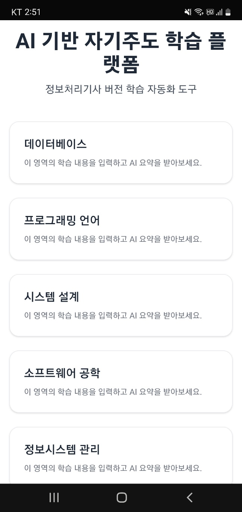
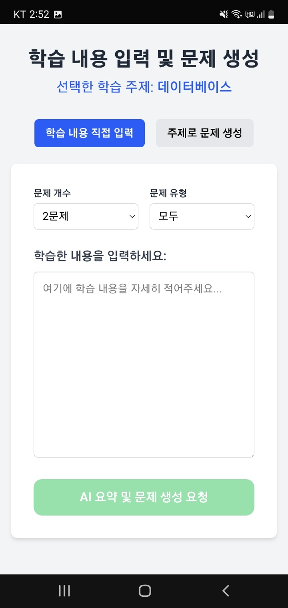
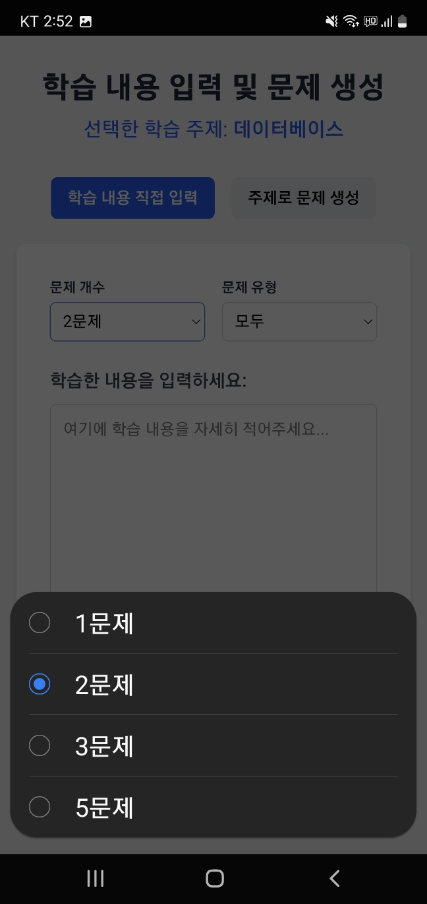
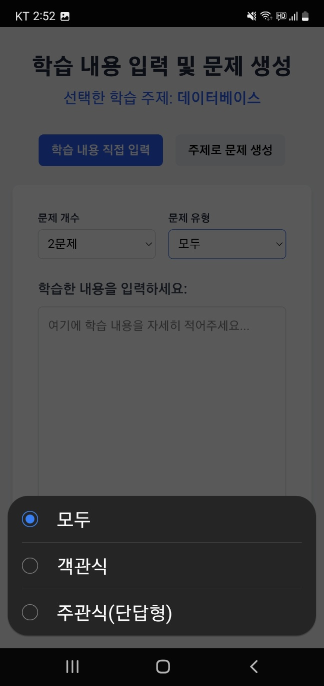
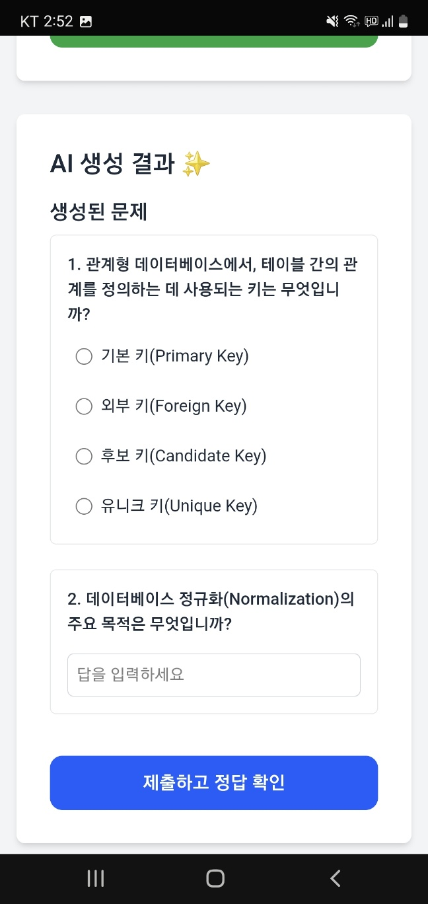
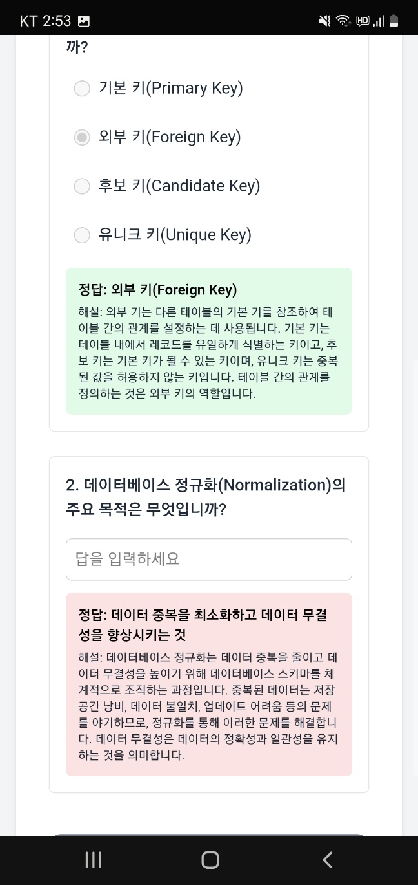

#  AI 기반 학습 도우미 (ai-study-app)

##  라이브 데모 (Live Demo)

지금 바로 AI 학습 도우미를 경험해보세요!
[https://ai-study-app-sooty.vercel.app/](https://ai-study-app-sooty.vercel.app/)

##  프로젝트 소개 (Project Overview)

이 프로젝트는 사용자가 입력한 학습 내용을 바탕으로 AI가 핵심 내용을 요약해주고, 다양한 유형의 예상 문제를 자동으로 생성해주는 자기주도 학습 지원 웹 애플리케이션입니다. 사용자는 직접 학습 노트를 입력하여 맞춤형 문제를 생성하거나, 특정 주제를 선택하여 AI가 추천하는 문제를 풀어보며 학습 효율을 높일 수 있습니다.

##  주요 기능 (Key Features)

* **AI 기반 요약 및 문제 생성:**
    * 사용자가 입력한 학습 내용에 대한 AI 핵심 요약 제공 (학습 내용 입력 모드)
    * 입력된 학습 내용 또는 선택된 주제를 기반으로 객관식/주관식(단답형) 문제 자동 생성
    * 생성된 모든 문제에 대한 정답 및 AI가 제공하는 상세 해설 확인 가능
* **사용자 맞춤 문제 생성 옵션:**
    * **모드 선택:** '학습 내용 직접 입력' 모드와 '주제로 문제 생성' 모드 중 선택 가능
    * **문제 개수 조절:** 생성할 문제의 개수를 1문제, 2문제, 3문제, 5문제 중에서 선택 가능
    * **문제 유형 선택:** '모두', '객관식만', '주관식(단답형)만' 중에서 문제 유형 선택 가능
* **인터랙티브 퀴즈 풀이 환경:**
    * AI가 생성한 문제를 즉시 풀어보고 답안 제출 가능
    * 제출 후 정답 및 해설을 바로 확인하며 학습 가능
* **사용자 친화적 인터페이스:**
    * Next.js와 Tailwind CSS를 활용하여 깔끔하고 직관적인 UI 제공
    * 모바일 환경에서도 원활하게 사용할 수 있는 반응형 디자인 적용

## 기술 스택 (Tech Stack)

* **프론트엔드 (Frontend):** Next.js (App Router), React, TypeScript, Tailwind CSS
* **AI 모델 (AI Model):** Google Gemini API
* **배포 (Deployment):** Vercel
* **버전 관리 (Version Control):** Git, GitHub

## 스크린샷 (Screenshots)

**메인 페이지 (주제 선택 화면)**

**학습 내용 입력 및 옵션 선택 화면**

**AI 생성 문제 및 퀴즈 풀이 화면**

## 개발 중 어려웠던 점 및 해결 과정 (Challenges & Solutions)

* **AI 응답 다양성 확보:**
    * **문제점:** '주제별 문제 생성' 기능에서 사용자가 1문제만 요청할 경우, AI가 특정 주제(예: 데이터베이스의 '키')에 대해 유사한 핵심 개념 위주로 문제를 반복 생성하는 경향을 보였습니다.
    * **해결 과정:**
    1.  Gemini API의 `temperature` 매개변수를 0.8로 조정하여 생성되는 응답의 무작위성을 높였습니다.
    2.  사용자가 1문제를 요청하더라도, 백엔드에서는 AI에게 내부적으로 3개의 문제를 생성하도록 요청한 후, 그중 하나를 랜덤하게 선택하여 사용자에게 제공하는 로직을 구현했습니다. 이를 통해 최종적으로 사용자에게 전달되는 문제의 다양성을 크게 향상시킬 수 있었습니다.

* **Next.js `useSearchParams` 사용에 따른 빌드 오류:**
    * **문제점:** `/study` 페이지에서 URL 쿼리 파라미터를 동적으로 읽기 위해 `useSearchParams` 훅을 사용했으나, 이로 인해 Vercel 배포 시 정적 페이지 생성(SSG) 과정에서 빌드 오류가 발생했습니다.
    * **해결 과정:** 처음에는 해당 페이지에 `export const dynamic = 'force-dynamic';` 설정을 시도했으나 문제가 지속되었습니다. 최종적으로 `useSearchParams`를 사용하는 부분을 별도의 클라이언트 컴포넌트(`StudyPageClientContent`)로 분리하고, 이를 `React.Suspense`로 감싸주어 클라이언트 사이드 렌더링을 명확히 하고 안정적인 동적 데이터 처리를 구현하여 빌드 문제를 해결했습니다.

* **AI API 연동 및 환경 변수 관리:**
    * **어려움:** Google Gemini API를 처음 연동하면서 API 키 발급, SDK 사용법 숙지, 그리고 특히 Vercel 배포 환경에서 API 키를 안전하게 환경 변수로 설정하고 관리하는 과정이 생소하여 초기 설정에 시간이 소요되었습니다.
    * **학습 및 해결:** 공식 문서와 예제 코드를 참고하여 API 호출 로직을 구현했으며, Vercel 프로젝트 설정에서 환경 변수를 올바르게 등록하여 로컬 개발 환경뿐만 아니라 배포 환경에서도 API가 안정적으로 작동하도록 구성했습니다. `.env.local` 파일을 활용한 로컬 환경 변수 관리와 `.gitignore`를 통한 민감 정보 유출 방지의 중요성도 인지하게 되었습니다.

##  향후 개선 계획 (Future Improvements)

* **사용자 기능 강화:**
    * 사용자 계정 시스템 도입 (NextAuth.js 활용)하여 학습 이력 및 오답노트 기능 구현
    * 데이터베이스 연동 (Supabase 또는 Firebase 등)을 통한 개인화된 데이터 영구 저장
    * 생성된 문제 세트 공유 기능 추가

* **학습 콘텐츠 확장 및 다양화:**
    * **다양한 학습 주제 지원:** 현재 '정보처리기사' 외 다른 자격증 시험 또는 일반 학습 분야를 선택할 수 있도록 기능 확장 (예: UI 좌측 상단 또는 메인 페이지에 주제/자격증 선택 목록 구현)
    * **새로운 문제 유형 도입:** AI 프롬프트 확장을 통해 빈칸 채우기, 참/거짓 문제 등 더욱 다양한 형식의 문제 지원
    * **엔터테인먼트 퀴즈 모드 추가:** 학습 목적 외에도 상식, 수도 맞추기, 사자성어, 속담 등 가볍게 즐길 수 있는 퀴즈 콘텐츠 도입

* **AI 기능 고도화:**
    * 사용자의 학습 수준이나 선호도에 따른 문제 난이도 조절 기능 추가 검토
    * AI 프롬프트 엔지니어링 지속적 개선을 통한 문제 품질 향상

* **사용자 경험(UI/UX) 개선:**
    * 전체적인 UI/UX 추가 개선 및 직관성 향상
    * 다크 모드 지원으로 사용자의 시각적 편의성 증대

---

*이 README는 프로젝트 진행 상황에 맞춰 계속 업데이트될 예정입니다.*